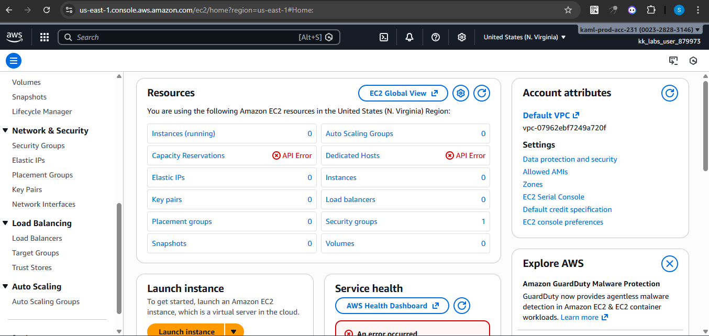
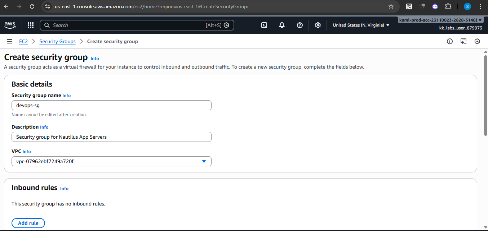
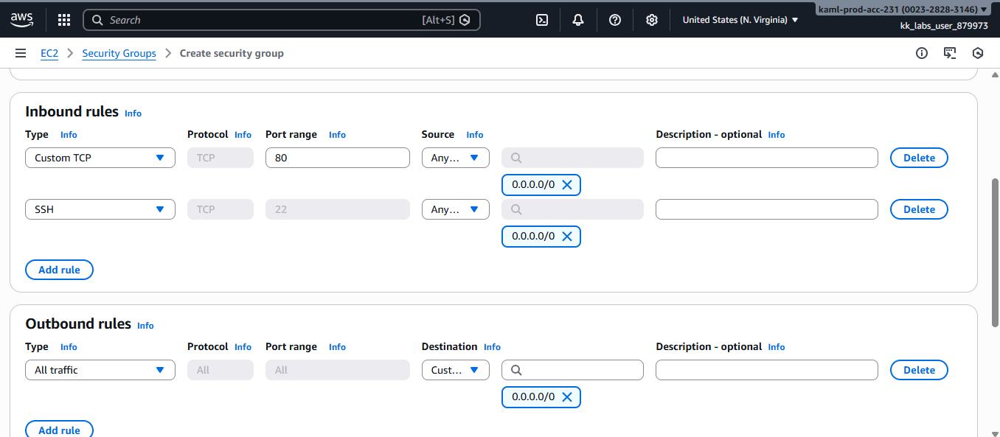
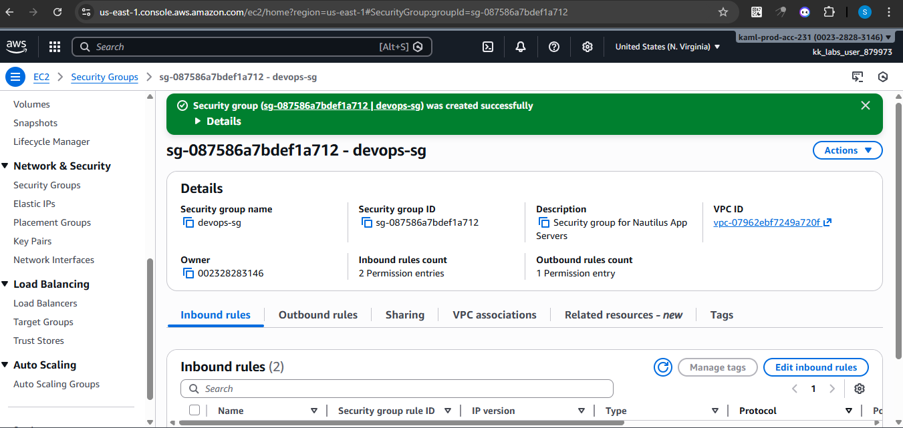

# AWS-security-group-setup
This project documents the step-by-step process of creating an AWS Security Group using the AWS Management Console (GUI)

An AWS Security Group acts as a virtual firewall for resources like EC2 instances.
It also controls who can access your resources and on which ports by defining inbound and outbound rules.

## Objectives
- Create a security group in the **default VPC**
- Allow inbound **HTTP (port 80)** traffic
- Allow inbound **SSH (port 22)** traffic

## Prerequisites
- An active AWS account
- Access to the AWS Management Console
- Default VPC available in the selected region

## Step-by-Step Implementation

### Step 1: Open the EC2 Dashboard
Navigate to the AWS Management Console and search for **EC2**.

### Step 2: Go to Security Groups
From the left-hand menu under **Network & Security**, click **Security Groups**.

### Step 3: Create a New Security Group
Click on **Create security group**.

### Step 4: Configure Basic Details
Fill in the following:
- **Security group name:**
- **Description:** 
- **VPC:** Default VPC

### Step 5: Add HTTP Inbound Rule
Add an inbound rule with the following configuration:
- **Type:** HTTP
- **Port:** 80
- **Source:** `0.0.0.0/0`

### Step 6: Add SSH Inbound Rule
Add another inbound rule:
- **Type:** SSH
- **Port:** 22
- **Source:** `0.0.0.0/0`

### Step 7: Review and Create
Review the rules and click **Create security group**.

## Security Note
Allowing SSH access from `0.0.0.0/0` is **not recommended for production environments**.  
For real-world deployments, SSH access should be restricted to:
- Specific IP addresses
- Bastion hosts
- VPN CIDR ranges

This configuration is intended for **learning and lab purposes only**.

